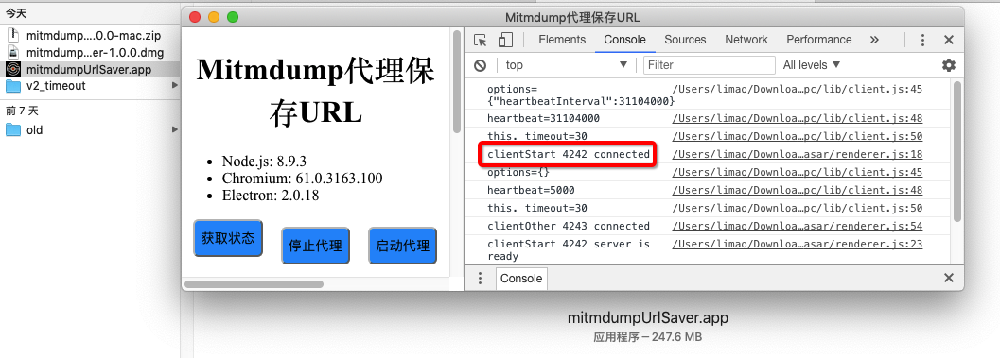
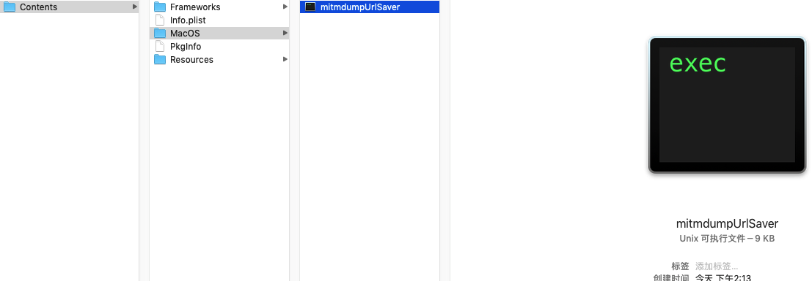
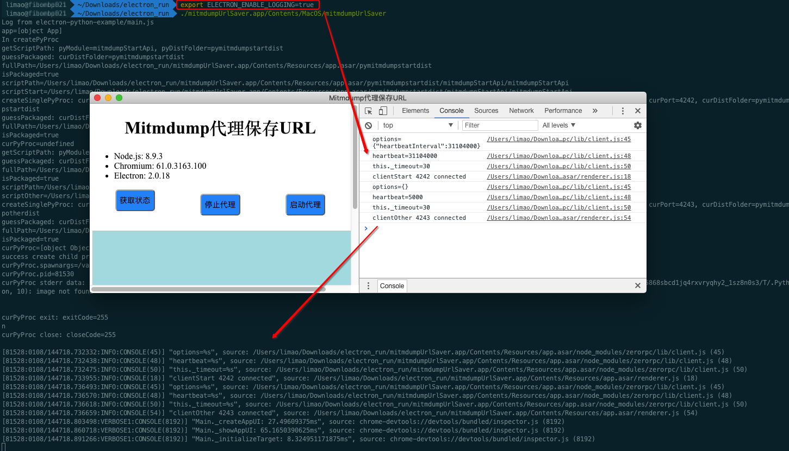
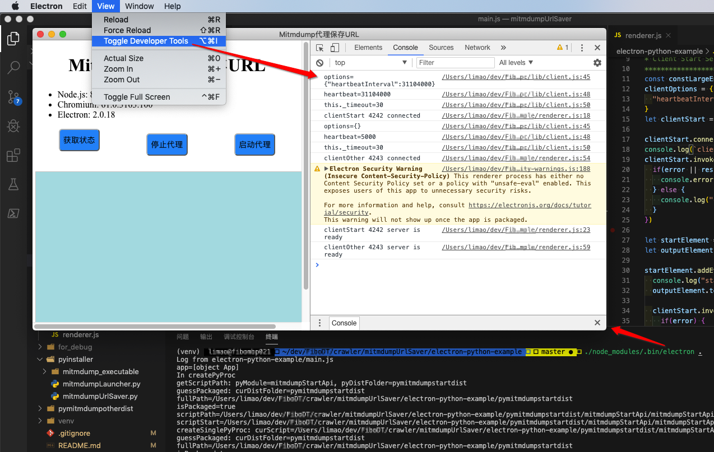

# Log日志

此处整理一些和**log日志**，`print`，`console.log`等相关的内容：

## 让main.js即js输出log日志文件到当前文件夹

文件：`electron-python-example/main.js`

```js
const path = require('path')

let logFilename = path.join(__dirname, "main_js.log")
let fs = require('fs');
let util = require('util');

var logFile = fs.createWriteStream(logFilename, { flags: 'a' });
  // Or 'w' to truncate the file every time the process starts.
var logStdout = process.stdout;
console.log = function () {
  logFile.write(util.format.apply(null, arguments) + '\n');
  logStdout.write(util.format.apply(null, arguments) + '\n');
}
console.error = console.log;
```

实现了之后的console.log：

```js
console.log("main.js: __dirname=%s", __dirname)
```

可以同时输出到：

* console终端
* log文件

## 让main.js中的console.log输出到Electron的devTool中的console的log中

* **背景**：

此处已有：

文件：`electron-python-example/main.js`

```js
...
const createWindow = () => {
  mainWindow = new BrowserWindow(
    {
      // width: 800,
      // height: 600,
      width: 1024,
      height: 768,
      // transparent: true,
      webPreferences: {
        nodeIntegration: true,
      }
    }
  )
  mainWindow.loadURL(require('url').format({
    pathname: path.join(__dirname, 'index.html'),
    protocol: 'file:',
    slashes: true
  }))
  mainWindow.webContents.openDevTools()

  mainWindow.on('closed', () => {
    mainWindow = null
  })
}
```

和 文件：`electron-python-example/renderer.js`

其中

文件：`electron-python-example/index.html`

```html
。。。
  <script>
    require('./renderer.js')
  </script>
</html>
```

可见：index.html中引用了renderer.js

去

```bash
./node_modules/.bin/electron .
```

调试electron时，有2种log：

* Electron界面中，右边可以看到html调用的`renderer.js`输出的log
    * 原因：由于`main.js`中的`mainWindow.webContents.openDevTools()`打开了`DevTools`
* 调试终端中：可以看到`main.js`的log
    * 因为是在VSCode的终端中运行的


而mac中打包后的Electron的app中，只能看到 Electron界面中（render.js打印）的log，看不到main.js中的log：



而此处希望，对于production生产模式，即mac中打包electron后得到的app文件 `mitmdumpUrlSaver.app`在其运行时也可以看到`main.js`中的log，以便于后续调试，当出错时找到原因。

* **最终方案**：

从界面中启动打包后的app内部的二进制文件，比如我的`mitmdumpUrlSaver.app`


对应内部的二进制文件

`./mitmdumpUrlSaver.app/Contents/MacOS/mitmdumpUrlSaver`



即可启动终端，运行此处的APP。终端中可以看到我们要的`main.js`中的log


* **进一步**：如果想要在当前终端中看到Electron的render.js中的log

则可以启动之前加上环境变量：

```bash
export ELECTRON_ENABLE_LOGGING=true
./mitmdumpUrlSaver.app/Contents/MacOS/mitmdumpUrlSaver
```

注：可以用echo确认变量是否已设置成功

```bash
 echo $ELECTRON_ENABLE_LOGGING
true
```

然后就也能看到`render.js`中的log了：



相关说明：

此处2个**js文件**，对应着2个**js线程**：
* `main.js` -> `node.js`的主线程
    * -》`main.js`中`console.log`输出到的地方
* `renderer.js` -> 显示界面的渲染线程 = Electron界面所在的线程
    * -》（调试时）Electron界面开启了`DevTools`后右边就能看到`console.log`输出的内容了
      * 