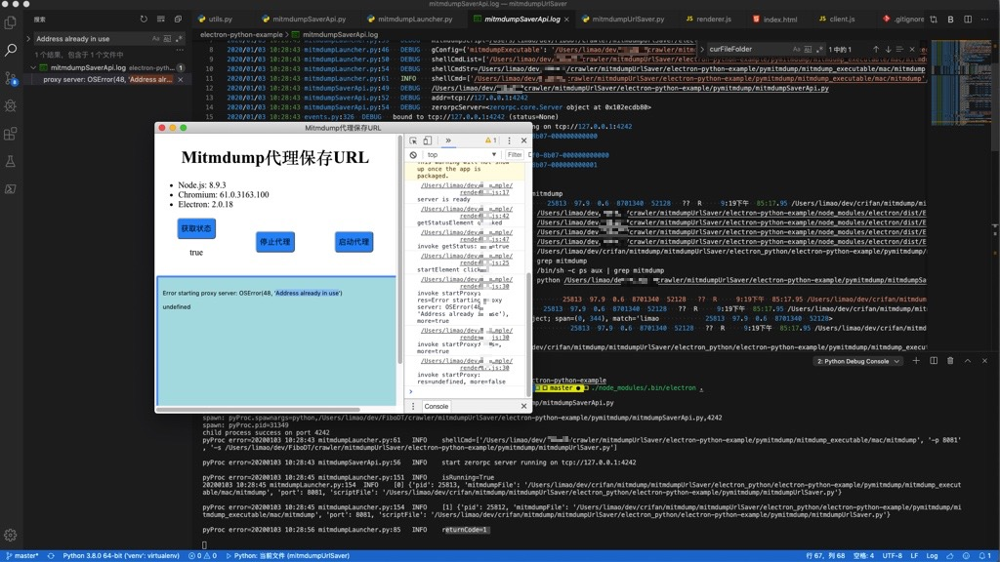
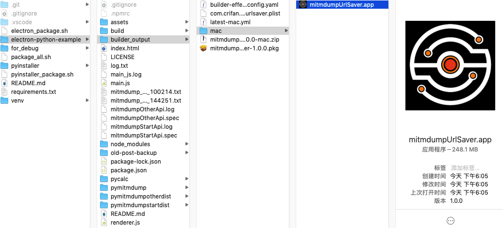
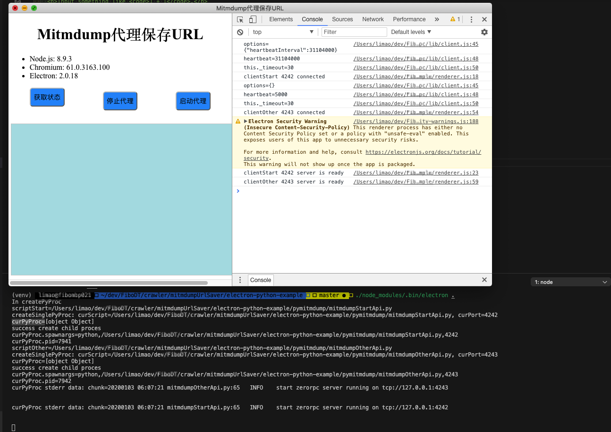
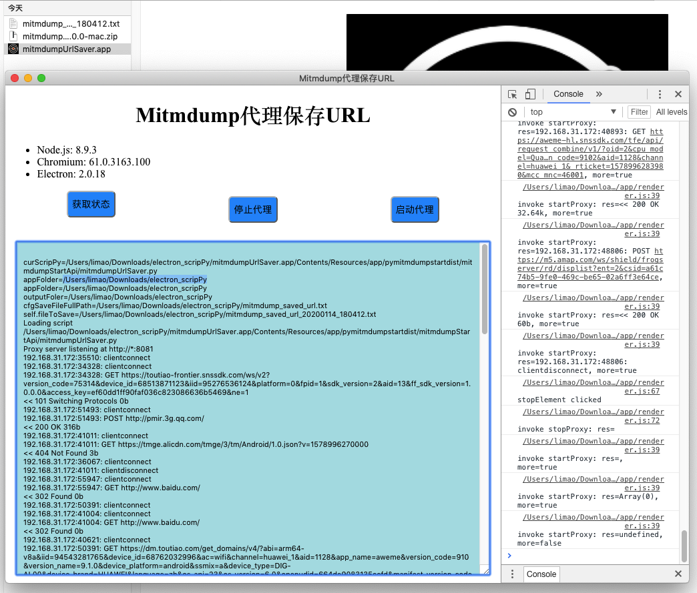
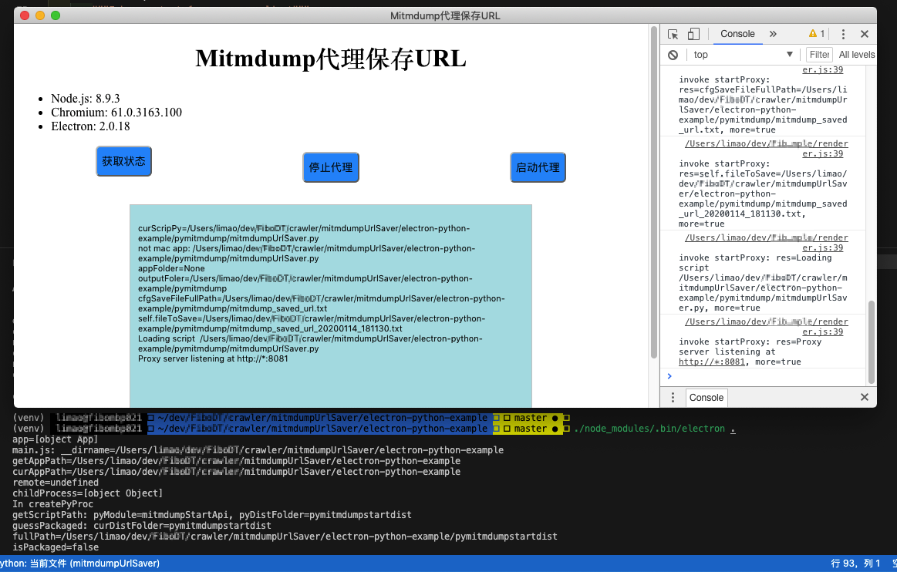

# electron-python-example

在参考`electron-python-example`给Electron添加Python支持期间，遇到很多问题。整理如下：

## npm install时zeromq会报错

* **解决办法**：把node从`13.5.0`换成`8.x`的版本，比如此处的

```bash
brew install node@8
```

安装出来后的版本是：`8.17.0`

详见：

【已解决】mac中npm install报错：make Release/obj.target/zmq/binding.o Error 1

## 能看到electron界面，但是输入计算表达式后，却看不到输出结果

* **原因**：可能有多种
* **思路**：通过electron的默认打开的console的log输出的错误信息中去找原因
  * 如果找不到合适错误原因，则可以尝试去给python的进程加上stdout和stderr

`electron-python-example/main.js`

```js
const createPyProc = () => {
  let script = getScriptPath()
  let port = '' + selectPort()


  if (guessPackaged()) {
    pyProc = require('child_process').execFile(script, [port])
  } else {
    pyProc = require('child_process').spawn('python', [script, port])
  }


  if (pyProc != null) {
    console.log('child process success on port ' + port)


    pyProc.stdout.on('data',function(data){
      var textChunk = data.toString('utf8') // buffer to string
      console.log("textChunk=%s", textChunk)
    })


    pyProc.stderr.on('data', function(data){
      console.log("pyProc error=%s", data)
    });
  }
}
```

用于查看到输出的普通信息和错误信息，以便于找到错误现象和原因

详见：

【已解决】electron-python-example运行后输入计算内容但是不显示结果

## Uncaught ReferenceError process is not defined

**解决办法**：加上参数配置`nodeIntegration: true`

`electron-python-example/main.js`

```js
const createWindow = () => {
  mainWindow = new BrowserWindow(
    {
      width: 800,
      height: 600,
      webPreferences: {
        nodeIntegration: true,
      }
    }
  )
```

详见：

【已解决】electron-python-example运行出错：Uncaught ReferenceError process is not defined

## renderer.js Error Lost remote after 10000ms

* **原因**：python的zerorpc没有安装，或者安装了zerorpc但是python进程没有正常启动
* **解决办法**：确保已安装zerorpc，且的确启动了对应进程

注：此处在虚拟环境virtualenv中

```bash
pip install zerorpc
```

然后确保

`electron-python-example/main.js`

```js
pyProc = require('child_process').spawn('python', [script, port])
```

正常启动了。

此处有2种确认方式：

* **方式1**：系统中查看是否有对应python进程

```bash
ps aux | grep 61737
```

其中的61737是python进程PID

是通过js中加了调试代码

```js
console.log('spawn: pyProc=%s', pyProc)
```

后，启动

```bash
./node_modules/.bin/electron .
```

时，看到console的log中的

```bash
  spawnfile: 'python',
  _handle: 
   Process {
     owner: [Circular],
     onexit: { [Function] [length]: 2, [name]: '' },
     pid: 61737
```

有对应python的pid的.。

如果有进程，说明python进程没问题，否则说明进程没正常启动。

* **方式2**： 加上`stdout`、`stderr`等监听

```js
  if (pyProc != null) {
    //console.log(pyProc)
    console.log('child process success on port ' + port)


    pyProc.stdout.on('data',function(data){
      var textChunk = data.toString('utf8') // buffer to string
      console.log("textChunk=%s", textChunk)
    })


    pyProc.stderr.on('data', function(data){
      console.log("pyProc error=%s", data)
    });
  }
```

确认没有error等异常错误信息

此处自己就是看到有

```bash
pyProc error=Traceback (most recent call last):
  File "/xxx/electron_python/electron-python-example/pycalc/api.py", line 4, in <module>
    import zerorpc
ModuleNotFoundError: No module named 'zerorpc'
```

从而发现：

是没有进入virtualenv的venv中，导致没有找到zerorpc

该确保进入虚拟环境：

```bash
source venv/bin/activate
```

即可找到`zerorpc`，正常启动python进程了。

## zerorpc.exceptions.LostRemote: Lost remote after 10s heartbeat

* **问题**：electron的python，用了stream后，运行了10秒后，报错：
  * js中：`invoke startSaver: error=Error: Lost remote after 10000ms`
  * python中：`zerorpc.exceptions.LostRemote: Lost remote after 10s heartbeat`
* **原因**：js和python端，底层都有heartbeat心跳机制，每隔一段时间，都要检测是否服务还有效alive，否则就报错。

而此处我的情况特殊：

js端，通过zerorpc通讯到python端

但是python端是`while True`的无限循环，除非进程被干掉，否则不返回

所以肯定无法满足heartbeat的10秒之内返回的要求

* **解决办法**：故意设置一个足够大的心跳时间

文件：`electron-python-example/renderer.js`

把：

```js
let client = new zerorpc.Client()
```

改为：

```js
const constLargeEnoughHeartbeat = 60 * 60 * 24 * 30 * 12
clientOptions = {
  "heartbeatInterval": constLargeEnoughHeartbeat,
}
let client = new zerorpc.Client(clientOptions)
```

以此规避此问题。

## Uncaught Error The module zeromq zmq.node was compiled against a different Node.js version

* **问题**：Electron运行
```bash
./node_modules/.bin/electron .
```
报错：
```bash
Uncaught Error: The module node_modules/zeromq/build/Release/zmq.node
was compiled against a different Node.js version using
NODE_MODULE_VERSION 57. This version of Node.js requires
NODE_MODULE_VERSION 75. Please try re-compiling or re-installing
the module (for instance, using `npm rebuild` or `npm install`).
```
* **原因**：此处安装的zeromq的库是针对于

`NODE_MODULE_VERSION 57 =  Node.js Node.js 8.x`

编译出来的，而当前用的node版本是：

`NODE_MODULE_VERSION 75 = Node.js Node.js 12.7.0`

所以不匹配，没法使用。

* **解决办法**：去重新编译出对应的匹配的`zeromq`库即可：

* **注意事项和准备工作**：

需要说明的是，此处当时node版本，已经是为了解决

```bash
npm install
```

期间 zerorpc出错，而去降低了node版本，从之前的 `node: 13.5.0`降低到了：`node：8.17.0`

且对于node和electron本身，不同版本之间是有依赖关系的，所以此处`node 8.17.0`，只能用`electron 2.0.18`

所以此处配置是：

文件：`electron_python/electron-python-example/package.json`

```json
  "devDependencies": {
    "electron": "^2.0.18",
```

文件：`electron_python/electron-python-example/.npmrc`

```json
npm_config_target="2.0.18" # electron version
```

* **解决步骤**

安装electron-rebuild：

```bash
npm install --save-dev electron-rebuild
```

重新去rebuild：

```bash
./node_modules/.bin/electron-rebuild
```

即可。


注：

编译之前，需要安装`cmake`

```bash
brew install cmake
```

详见：

【已解决】Electron报错：Uncaught Error The module zeromq zmq.node was compiled against a different Node.js version

## 优化：被调用python代码的print为输出日志到log文件

* **背景**：希望被调用的python代码的print的日志输出改为输出到log日志文件中，便于后期调试查看log
* **解决办法**：

文件：`electron-python-example/pymitmdump/mitmdumpSaverApi.py`

```python
from utils import loggingInit
logFilename = "mitmdumpSaverApi.log"
loggingInit(logFilename)


# from __future__ import print_function
from mitmdumpLauncher import startMitmdumpSaver, getMitmdumpStatus
import sys
import os
import zerorpc
import logging

...

def main():
    logging.debug(__file__)

    addr = 'tcp://127.0.0.1:' + parse_port()
```

相关的logging的初始化：

文件：`electron-python-example/pymitmdump/utils.py`

```python
# _*_ coding: utf-8 _*_
# Function: Crifan's utils functions, copy from https://github.com/crifan/crifanLibPython
# Update: 20200103
# Author: Crifan Li

import os
import sys
from datetime import datetime, timedelta
import logging
# print("sys.executable=%s" % sys.executable)
# sys.executable=/Users/limao/dev/xxx/crawler/mitmdumpUrlSaver/venv/bin/python3.8

...

CURRENT_LIB_FILENAME = "crifanLogging"

LOG_FORMAT_FILE = "%(asctime)s %(filename)s:%(lineno)-4d %(levelname)-7s %(message)s"
LOG_LEVEL_FILE = logging.DEBUG
LOG_FORMAT_CONSOLE = "%(asctime)s %(filename)s:%(lineno)-4d %(levelname)-7s %(message)s"
LOG_LEVEL_CONSOLE = logging.INFO

def loggingInit(filename = None,
                fileLogLevel = LOG_LEVEL_FILE,
                fileLogFormat = LOG_FORMAT_FILE,
                fileLogDateFormat = '%Y/%m/%d %I:%M:%S',
                enableConsole = True,
                consoleLogLevel = LOG_LEVEL_CONSOLE,
                consoleLogFormat = LOG_FORMAT_CONSOLE,
                consoleLogDateFormat = '%Y%m%d %I:%M:%S',
                ):
    """
    init logging for both log to file and console

    :param logFilename: input log file name
        if not passed, use current lib filename
    :return: none
    """
    logFilename = ""
    if filename:
        logFilename = filename
    else:
        # logFilename = __file__ + ".log"
        # '/Users/crifan/dev/dev_root/xxx/crifanLogging.py.log'
        logFilename = CURRENT_LIB_FILENAME + ".log"

    # logging.basicConfig(
    #                 level    = fileLogLevel,
    #                 format   = fileLogFormat,
    #                 datefmt  = fileLogDateFormat,
    #                 filename = logFilename,
    #                 encoding = "utf-8",
    #                 filemode = 'w')

    # rootLogger = logging.getLogger()
    rootLogger = logging.getLogger("")
    rootLogger.setLevel(fileLogLevel)
    fileHandler = logging.FileHandler(
        filename=logFilename,
        mode='w',
        encoding="utf-8")
    fileHandler.setLevel(fileLogLevel)
    fileFormatter = logging.Formatter(
        fmt=fileLogFormat,
        datefmt=fileLogDateFormat
    )
    fileHandler.setFormatter(fileFormatter)
    rootLogger.addHandler(fileHandler)

    if enableConsole :
        # define a Handler which writes INFO messages or higher to the sys.stderr
        console = logging.StreamHandler()
        console.setLevel(consoleLogLevel)
        # set a format which is simpler for console use
        formatter = logging.Formatter(
            fmt=consoleLogFormat,
            datefmt=consoleLogDateFormat)
        # tell the handler to use this format
        console.setFormatter(formatter)
        rootLogger.addHandler(console)
。。。
```

被调用的python

文件：`electron-python-example/pymitmdump/mitmdumpLauncher.py`

```python
...
import subprocess
import os
import re
import logging
from utils import osIsMacOS, osIsWinows
...
curFileFolder = os.path.dirname(__file__)
logging.debug("curFileFolder=%s", curFileFolder) # curFileFolder=/Users/limao/dev/crifan/mitmdump/mitmdumpUrlSaver/pyinstaller
...
```

即可正常输出log日志到文件中了：



## 获取Mac中electron-builder打包出的app通过双击启动时app文件所在的文件夹路径

* **背景**：Mac中带Python的Electron打包后是app文件，双击app运行，希望在运行期间获取app所在目录

文件：`electron-python-example/pymitmdump/mitmdumpStartApi.py`

```python
import os
import sys
import logging
from utils import getFilenameNoPointSuffix, loggingInit

sysMeipass = None
sysArgv0 = sys.argv[0]
hasMeipass = hasattr(sys, '_MEIPASS')
isBundled = hasMeipass
if isBundled:
    # /xxx/pymitmdumpstartdist/mitmdumpStartApi/mitmdumpStartApi -> mitmdumpStartApi
    logFilenameNoSuffix = sysArgv0.split(os.path.sep)[-1]
    logFilename = "%s.log" % logFilenameNoSuffix
    sysMeipass = sys._MEIPASS
    logPath = sysMeipass
else:
    logFilename = "%s.log" % getFilenameNoPointSuffix(__file__)
    logPath = os.path.dirname(__file__)
logFullPath = os.path.join(logPath, logFilename)
# logFullPath = "/Users/limao/Downloads/electron_app/mitmdumpStartApi.log"
loggingInit(logFullPath)

logging.debug("sysArgv0=%s", sysArgv0)
logging.debug("hasMeipass=%s", hasMeipass)
logging.debug("sysMeipass=%s", sysMeipass)

logging.debug("logFilename=%s", logFilename)
logging.debug("logPath=%s", logPath)
logging.debug("logFullPath=%s", logFullPath)

sysExecutable = sys.executable
logging.debug("sysExecutable=%s", sysExecutable)
sysArgv = sys.argv
logging.debug("sysArgv=%s", sysArgv)
hasFrozen = hasattr(sys, 'frozen')
logging.debug("hasFrozen=%s", hasFrozen)
if hasFrozen:
    sysForzen = sys.frozen
    logging.debug("sysForzen=%s", sysForzen)

logging.debug("os.getcwd=%s", os.getcwd())
logging.debug("os.curdir=%s", os.curdir)
logging.debug("__file__=%s", __file__)
logging.debug("__name__=%s", __name__)
```

可以获取到对应路径：

* **打包后**：bundle的=`是二进制` 的路径

(PyInstaller)打包后的（且后来再用electron-builder打包在一起的，所生成的）app文件，双击运行后对应输出是：

```bash
2020/01/13 06:05:51 mitmdumpStartApi.py:23 DEBUG sysArgv0=/Users/limao/dev/xxx/crawler/mitmdumpUrlSaver/electron-python-example/builder_output/mac/mitmdumpUrlSaver.app/Contents/Resources/app/pymitmdumpstartdist/mitmdumpStartApi/mitmdumpStartApi
2020/01/13 06:05:51 mitmdumpStartApi.py:24 DEBUG hasMeipass=True
2020/01/13 06:05:51 mitmdumpStartApi.py:25 DEBUG sysMeipass=/Users/limao/dev/xxx/crawler/mitmdumpUrlSaver/electron-python-example/builder_output/mac/mitmdumpUrlSaver.app/Contents/Resources/app/pymitmdumpstartdist/mitmdumpStartApi
2020/01/13 06:05:51 mitmdumpStartApi.py:27 DEBUG logFilename=mitmdumpStartApi.log
2020/01/13 06:05:51 mitmdumpStartApi.py:28 DEBUG logPath=/Users/limao/dev/xxx/crawler/mitmdumpUrlSaver/electron-python-example/builder_output/mac/mitmdumpUrlSaver.app/Contents/Resources/app/pymitmdumpstartdist/mitmdumpStartApi
2020/01/13 06:05:51 mitmdumpStartApi.py:29 DEBUG logFullPath=/Users/limao/dev/xxx/crawler/mitmdumpUrlSaver/electron-python-example/builder_output/mac/mitmdumpUrlSaver.app/Contents/Resources/app/pymitmdumpstartdist/mitmdumpStartApi/mitmdumpStartApi.log
2020/01/13 06:05:51 mitmdumpStartApi.py:32 DEBUG sysExecutable=/Users/limao/dev/xxx/crawler/mitmdumpUrlSaver/electron-python-example/builder_output/mac/mitmdumpUrlSaver.app/Contents/Resources/app/pymitmdumpstartdist/mitmdumpStartApi/mitmdumpStartApi
2020/01/13 06:05:51 mitmdumpStartApi.py:34 DEBUG sysArgv=['/Users/limao/dev/xxx/crawler/mitmdumpUrlSaver/electron-python-example/builder_output/mac/mitmdumpUrlSaver.app/Contents/Resources/app/pymitmdumpstartdist/mitmdumpStartApi/mitmdumpStartApi', '4242']
2020/01/13 06:05:51 mitmdumpStartApi.py:36 DEBUG hasFrozen=True
2020/01/13 06:05:51 mitmdumpStartApi.py:39 DEBUG sysForzen=True
2020/01/13 06:05:51 mitmdumpStartApi.py:41 DEBUG os.getcwd=/
2020/01/13 06:05:51 mitmdumpStartApi.py:42 DEBUG os.curdir=.
2020/01/13 06:05:51 mitmdumpStartApi.py:43 DEBUG __file__=mitmdumpStartApi.py
2020/01/13 06:05:51 mitmdumpStartApi.py:44 DEBUG __name__=__main__
2020/01/13 06:05:51 mitmdumpStartApi.py:101 DEBUG mitmdumpStartApi.py
。。。
```

其中此处app本身所在位置是：



输出的路径是：

* `sysArgv0`：
  * `/Users/limao/dev/xxx/crawler/mitmdumpUrlSaver/electron-python-example/builder_output/mac/mitmdumpUrlSaver.app/Contents/Resources/app/pymitmdumpstartdist/mitmdumpStartApi/mitmdumpStartApi`
* `logPath`：
  * `/Users/limao/dev/xxx/crawler/mitmdumpUrlSaver/electron-python-example/builder_output/mac/mitmdumpUrlSaver.app/Contents/Resources/app/pymitmdumpstartdist/mitmdumpStartApi`
    * 其实也就是`sysMeipass`的值

* **没打包之前**：是源码=是xxx.py=此处是`mitmdumpStartApi.py` 的路径

注意：此处先要删除2个dist目录（pymitmdumpstartdist和pymitmdumpotherdist）

运行

```bash
./node_modules/.bin/electron .
```

输出：

```bash
2020/01/13 06:13:55 mitmdumpStartApi.py:23 DEBUG sysArgv0=/Users/limao/dev/xxx/crawler/mitmdumpUrlSaver/electron-python-example/pymitmdump/mitmdumpStartApi.py
2020/01/13 06:13:55 mitmdumpStartApi.py:24 DEBUG hasMeipass=False
2020/01/13 06:13:55 mitmdumpStartApi.py:25 DEBUG sysMeipass=None
2020/01/13 06:13:55 mitmdumpStartApi.py:27 DEBUG logFilename=mitmdumpStartApi.log
2020/01/13 06:13:55 mitmdumpStartApi.py:28 DEBUG logPath=/Users/limao/dev/xxx/crawler/mitmdumpUrlSaver/electron-python-example/pymitmdump
2020/01/13 06:13:55 mitmdumpStartApi.py:29 DEBUG logFullPath=/Users/limao/dev/xxx/crawler/mitmdumpUrlSaver/electron-python-example/pymitmdump/mitmdumpStartApi.log
2020/01/13 06:13:55 mitmdumpStartApi.py:32 DEBUG sysExecutable=/Users/limao/dev/xxx/crawler/mitmdumpUrlSaver/venv/bin/python
2020/01/13 06:13:55 mitmdumpStartApi.py:34 DEBUG sysArgv=['/Users/limao/dev/xxx/crawler/mitmdumpUrlSaver/electron-python-example/pymitmdump/mitmdumpStartApi.py', '4242']
2020/01/13 06:13:55 mitmdumpStartApi.py:36 DEBUG hasFrozen=False
2020/01/13 06:13:55 mitmdumpStartApi.py:41 DEBUG os.getcwd=/Users/limao/dev/xxx/crawler/mitmdumpUrlSaver/electron-python-example
2020/01/13 06:13:55 mitmdumpStartApi.py:42 DEBUG os.curdir=.
2020/01/13 06:13:55 mitmdumpStartApi.py:43 DEBUG __file__=/Users/limao/dev/xxx/crawler/mitmdumpUrlSaver/electron-python-example/pymitmdump/mitmdumpStartApi.py
2020/01/13 06:13:55 mitmdumpStartApi.py:44 DEBUG __name__=__main__
2020/01/13 06:13:55 mitmdumpStartApi.py:101 DEBUG /Users/limao/dev/xxx/crawler/mitmdumpUrlSaver/electron-python-example/pymitmdump/mitmdumpStartApi.py
。。。
```

可见：`sys`没有`frozen`，也没有`_MEIPASS`值。

## 打包electron-python的单个主文件报错：OSError Python library not found libpython3.8m.dylib

* **问题**：mac中用PyInstaller打包python报错`OSError Python library not found libpython3.8m.dylib`
* **原因**：此处PyInstaller打包需要**动态库**，类似于`libpython3.8m.dylib`，而默认安装的python是静态库 `/Users/limao/.pyenv/versions/3.8.0/lib/libpython3.8.a`
* **解决办法**：重新安装带动态库的python 3.8
* **具体步骤**：加上参数重新编译：

最好先去删除之前旧的python：

```bash
pyenv uninstall 3.8.0
rm -rf /Users/limao/.pyenv/versions/3.8.0/
```

然后再去重新安装：

```bash
env PYTHON_CONFIGURE_OPTS="--enable-framework" pyenv install 3.8.0
```

即可正常使用`PyInstaller`。

其他说明：

（1）此处安装后对应的动态库是

```bash
limao@xxx  ~  ll /Users/limao/.pyenv/versions/3.8.0/Python.framework/Versions/3.8/lib
total 0
lrwxr-xr-x    1 limao  CORP\Domain Users     9B  1  6 10:34 libpython3.8.dylib -> ../Python
```

软链接对应的文件是：3.4MB的`Python`

```bash
~  ll /Users/limao/.pyenv/versions/3.8.0/Python.framework/Versions/3.8/Python
-rwxr-xr-x  1 limao  CORP\Domain Users   3.4M  1  6 10:34 /Users/limao/.pyenv/versions/3.8.0/Python.framework/Versions/3.8/Python
```

（2）此处安装后，还需要安装项目所依赖的一些库

比如：

```bash
pip install virtualenv

virtualenv venv
source venv/bin/activate 

pip install zerorpc
```

## zerorpc的stream持续输出无返回导致后续函数stopProxy无法调用

* **问题**：mitmdumpSaverApi.py中调用启动代理后，代理没有输出。
* **原因**：由于启动代理，内部逻辑是，没有立刻返回，而是通过stream持续返回输出，导致进程被占用，所以stopProxy都没有被执行到
* **解决办法**：新增一个进程，额外单独的去处理关闭代理（以及获取代理状态）
* **具体步骤**：

js中createPyProc创建了2个线程：

文件：`electron-python-example/main.js`

```js
const electron = require('electron')
const app = electron.app
const BrowserWindow = electron.BrowserWindow
const path = require('path')

/*************************************************************
 * py process
 *************************************************************/

// const PY_DIST_FOLDER = 'pycalcdist'
const PY_DIST_FOLDER = 'pymitmdumpdist'

// const PY_FOLDER = 'pycalc'
// const PY_MODULE = 'api' // without .py suffix

const PY_FOLDER = 'pymitmdump'
// const PY_MODULE = 'mitmdumpSaverApi' // without .py suffix
const PY_MODULE_START = 'mitmdumpStartApi' // without .py suffix
const PY_MODULE_OTHER = 'mitmdumpOtherApi' // without .py suffix

PORT_START = 4242
PORT_OTHER = 4243

// let pyProc = null
let pyProcStart = null
let pyProcOther = null
// let pyPort = null

const guessPackaged = () => {
  // console.log("guessPackaged")
  const fullPath = path.join(__dirname, PY_DIST_FOLDER)
  // console.log("fullPath=%s", fullPath)
  isPackaged = require('fs').existsSync(fullPath)
  // console.log("isPackaged=%s", isPackaged)
  return isPackaged
}

// const getScriptPath = () => {
//   if (!guessPackaged()) {
//     return path.join(__dirname, PY_FOLDER, PY_MODULE + '.py')
//   }
//   if (process.platform === 'win32') {
//     return path.join(__dirname, PY_DIST_FOLDER, PY_MODULE, PY_MODULE + '.exe')
//   }
//   return path.join(__dirname, PY_DIST_FOLDER, PY_MODULE, PY_MODULE)
// }

const getScriptPath = (pyModule) => {
  if (!guessPackaged()) {
    return path.join(__dirname, PY_FOLDER, pyModule + '.py')
  }
  if (process.platform === 'win32') {
    return path.join(__dirname, PY_DIST_FOLDER, pyModule, pyModule + '.exe')
  }
  return path.join(__dirname, PY_DIST_FOLDER, pyModule, pyModule)
}

const getScriptPathStart = () => {
  return getScriptPath(PY_MODULE_START)
}

const getScriptPathOther = () => {
  return getScriptPath(PY_MODULE_OTHER)
}

// const selectPort = () => {
//   pyPort = 4242
//   return pyPort
// }

const createSinglePyProc = (curScript, curPort) => {
  console.log('createSinglePyProc: curScript=%s, curPort=%s', curScript, curPort)
  let curPyProc = null

  if (guessPackaged()) {
    // curPyProc = require('child_process').execFile(curScript)
    curPyProc = require('child_process').execFile(curScript, [curPort])
  } else {
    // curPyProc = require('child_process').spawn('python', [curScript])
    curPyProc = require('child_process').spawn('python', [curScript, curPort])
  }

  console.log('curPyProc=%s', curPyProc)

  if (curPyProc != null) {
    console.log("success create child proces")
    // console.log('curPyProc=%o', curPyProc)
    console.log('curPyProc.spawnargs=%s', curPyProc.spawnargs)
    console.log('curPyProc.pid=%s', curPyProc.pid)

    curPyProc.stdout.on('data',function(chunk){
      var chunkUtf8Str = chunk.toString('utf8') // buffer to string
      console.log("curPyProc stdout data: chunkUtf8Str=%s", chunkUtf8Str)
    })

    curPyProc.stderr.on('data', function(chunk){
      console.error("curPyProc stderr data: chunk=%s\r\n", chunk)
    })

    curPyProc.on('close', function(closeCode){
      console.log("curPyProc close: closeCode=%s\r\n", closeCode)
    })
    // for Windows:
    curPyProc.on('exit', function(exitCode){
      console.log("curPyProc exit: exitCode=%s\r\nn", exitCode)
    })
  }

  return curPyProc
}

const createPyProc = () => {
  console.log('In createPyProc')
  // let script = getScriptPath()
  // console.log('script=%s', script)
  // let port = '' + selectPort()
  // console.log('port=%s', port)

  let scriptStart = getScriptPathStart()
  console.log('scriptStart=%s', scriptStart)
  pyProcStart = createSinglePyProc(scriptStart, PORT_START)


  let scriptOther = getScriptPathOther()
  console.log('scriptOther=%s', scriptOther)
  pyProcOther = createSinglePyProc(scriptOther, PORT_OTHER)
}

const exitPyProc = () => {
  // pyProc.kill()
  // pyProc = null
  console.log('exitPyProc')

  if (pyProcStart != null) {
    pyProcStart.kill()
    pyProcStart = null  
  }

  if (pyProcOther != null) {
    pyProcOther.kill()
    pyProcOther = null
  }

  // pyPort = null
}

app.on('ready', createPyProc)
app.on('will-quit', exitPyProc)

...
```

文件：`electron-python-example/renderer.js`

```js
const zerorpc = require("zerorpc")

// let client = new zerorpc.Client()

PORT_START = 4242
PORT_OTHER = 4243

/****************************************
* Client Start Server
****************************************/
const constLargeEnoughHeartbeat = 60 * 60 * 24 * 30 * 12 // 1 Year
clientOptions = {
  "heartbeatInterval": constLargeEnoughHeartbeat,
}
let clientStart = new zerorpc.Client(clientOptions)

clientStart.connect(`tcp://127.0.0.1:${PORT_START}`)
console.log(`clientStart ${PORT_START} connected`)
clientStart.invoke("echo", "server ready", (error, res) => {
  if(error || res !== 'server ready') {
    console.error(error)
  } else {
    console.log("clientStart %d server is ready", PORT_START)
  }
})

let startElement = document.querySelector('#startProxy')
let outputElement = document.querySelector('#output')

startElement.addEventListener('click', () => {
  console.log("startElement clicked")
  outputElement.textContent = "" // clear before start

  clientStart.invoke("startProxy", (error, res, more) => {
    if(error) {
      console.error("invoke startProxy: error=%s, more=%s", error, more)
    } else {
      console.log("invoke startProxy: res=%s, more=%s", res, more)
      if (res != undefined) {
        outputElement.textContent += "\n" + res
        // outputElement.textContent += res
      }
      outputElement.scrollTop = outputElement.scrollHeight
    }
  })
})

/****************************************
* Client Other Server
****************************************/
let clientOther = new zerorpc.Client()

clientOther.connect(`tcp://127.0.0.1:${PORT_OTHER}`)
console.log(`clientOther ${PORT_OTHER} connected`)
clientOther.invoke("echo", "server ready", (error, res) => {
  if(error || res !== 'server ready') {
    console.error(error)
  } else {
    console.log("clientOther %d server is ready", PORT_OTHER)
  }
})

let stopElement = document.querySelector('#stopProxy')

stopElement.addEventListener('click', () => {
  console.log("stopElement clicked")
  clientOther.invoke("stopProxy", (error, res) => {
    if(error) {
      console.error("invoke stopProxy: error=%s", error)
    } else {
      console.log("invoke stopProxy: res=%s", res)
    }
  })
})

let getStatusElement = document.querySelector('#getStatus')
let statusElement = document.querySelector('#serverStatus')

getStatusElement.addEventListener('click', () => {
  console.log("getStatusElement clicked")
  clientOther.invoke("getStatus", (error, res) => {
    if(error) {
      console.error("invoke getStatus: error=%s", error)
    } else {
      console.log("invoke getStatus: res=%s", res)
      statusElement.textContent = res
    }
  })
})
```

分别调用的python脚本文件是：

文件：`electron-python-example/pymitmdump/mitmdumpStartApi.py`

```python
from utils import getFilenameNoPointSuffix, loggingInit
loggingInit("%s.log" % getFilenameNoPointSuffix(__file__))

from mitmdumpManage import startMitmdumpSaver
import sys
import zerorpc
import logging

class MitmdumpStartApi(object):
    def echo(self, text):
        """Echo any text from zerorpc client"""
        logging.debug("text=%s", text)
        return text

    @zerorpc.stream
    def startProxy(self):
        """Start mitmdump proxy"""
        logging.debug("startProxy")
        startResp = startMitmdumpSaver()
        logging.debug("startResp=%s", startResp)
        return startResp

def parse_port():
    port = 4242
    try:
        port = int(sys.argv[1])
    except Exception as e:
        pass
    curPortStr = '{}'.format(port)
    return curPortStr

def main():
    logging.debug(__file__)

    addr = 'tcp://127.0.0.1:' + parse_port()
    logging.debug("addr=%s", addr)
    zerorpcServer = zerorpc.Server(MitmdumpStartApi())
    logging.debug("zerorpcServer=%s", zerorpcServer)
    zerorpcServer.bind(addr)
    logging.info('start zerorpc server running on %s', addr)
    zerorpcServer.run()

if __name__ == '__main__':
    main()
```

和：

文件：`electron-python-example/pymitmdump/mitmdumpOtherApi.py`

```python
from utils import getFilenameNoPointSuffix, loggingInit
loggingInit("%s.log" % getFilenameNoPointSuffix(__file__))

from mitmdumpManage import getMitmdumpStatus, stopMitmdump
import sys
import zerorpc
import logging

class MitmdumpOtherApi(object):
    def echo(self, text):
        """Echo any text from zerorpc client"""
        logging.debug("text=%s", text)
        return text

    def getStatus(self):
        """Get mitmdump server status"""
        logging.debug("getStatus")
        isRunning, processList = getMitmdumpStatus()
        logging.debug("isRunning=%s, processList=%s", isRunning, processList)
        return isRunning
        # return isRunning, processList

    def stopProxy(self):
        """Stop mitmdump proxy"""
        logging.debug("stopProxy")
        stopResp = stopMitmdump()
        logging.debug("stopResp=%s", stopResp)
        return stopResp

def parse_port():
    port = 4242
    try:
        port = int(sys.argv[1])
    except Exception as e:
        pass
    curPortStr = '{}'.format(port)
    return curPortStr

def main():
    logging.debug(__file__)

    addr = 'tcp://127.0.0.1:' + parse_port()
    logging.debug("addr=%s", addr)
    zerorpcServer = zerorpc.Server(MitmdumpOtherApi())
    logging.debug("zerorpcServer=%s", zerorpcServer)
    zerorpcServer.bind(addr)
    logging.info('start zerorpc server running on %s', addr)
    zerorpcServer.run()

if __name__ == '__main__':
    main()
```

其中都调用了最底层实现逻辑的代码：

文件：`electron-python-example/pymitmdump/mitmdumpManage.py`

```python
# _*_ coding: utf-8 _*_
# Function: Launch mitmdump to start script service to proxy to save url
# Update: 20191231
# Author: Crifan Li

import subprocess
import os
import re
import logging
from utils import osIsMacOS, osIsWinows

def startMitmdumpSaver():
    """Start mitmdump saver"""
    logging.debug("startMitmdumpSaver")

    isUseShell = False
    # isUseShell = True

    curFileFolder = os.path.dirname(__file__)
    logging.debug("curFileFolder=%s", curFileFolder) # curFileFolder=/Users/limao/dev/crifan/mitmdump/mitmdumpUrlSaver/pyinstaller

    Mitmdump_Mac = "mitmdump_executable/mac/mitmdump"
    Mitmdump_Win = "mitmdump_executable/win/mitmdump.exe"
    mitmdumpExecutablePath = None
    if osIsMacOS():
        mitmdumpExecutablePath = Mitmdump_Mac
    elif osIsWinows():
        mitmdumpExecutablePath = Mitmdump_Win
    logging.debug("mitmdumpExecutablePath=%s", mitmdumpExecutablePath) # mitmdumpExecutablePath=mitmdump_executable/mac/mitmdump

    mitmdumpExecutableFullPath = os.path.join(curFileFolder, mitmdumpExecutablePath)
    logging.debug("mitmdumpExecutableFullPath=%s", mitmdumpExecutableFullPath) # mitmdumpExecutableFullPath=/Users/limao/dev/crifan/mitmdump/mitmdumpUrlSaver/pyinstaller/mitmdump_executable/mac/mitmdump
    # mitmdumpExecutable = "mitmdump"
    # mitmdumpExecutable = "pyinstaller/mitmdump_executable/mac/mitmdump"
    mitmdumpExecutable = mitmdumpExecutableFullPath
    logging.debug("mitmdumpExecutable=%s", mitmdumpExecutable) # mitmdumpExecutable=/Users/limao/dev/crifan/mitmdump/mitmdumpUrlSaver/pyinstaller/mitmdump_executable/mac/mitmdump

    mitmdumpScriptFilename = "mitmdumpUrlSaver.py"
    logging.debug("mitmdumpScriptFilename=%s", mitmdumpScriptFilename)
    mitmdumpScriptFullPath = os.path.join(curFileFolder, mitmdumpScriptFilename)
    logging.debug("mitmdumpScriptFullPath=%s", mitmdumpScriptFullPath) # mitmdumpScriptFullPath=/Users/limao/dev/crifan/mitmdump/mitmdumpUrlSaver/pyinstaller/mitmdumpUrlSaver.py
    mitmdumpScript = mitmdumpScriptFullPath
    logging.debug("mitmdumpScript=%s", mitmdumpScript)

    gConfig = {
        "mitmdumpExecutable": mitmdumpExecutable,
        "port": 8081,
        "mitmdumpScript": mitmdumpScript,
    }
    logging.debug("gConfig=%s", gConfig)

    # shellCmdList = ['ping', '-c 4', 'www.crifan.com']
    shellCmdList = ['%s' % gConfig["mitmdumpExecutable"], '-p %s' % gConfig["port"], '-s %s' % gConfig["mitmdumpScript"]]
    logging.debug("shellCmdList=%s", shellCmdList)
    # shellCmdList=['/Users/limao/dev/crifan/mitmdump/mitmdumpUrlSaver/pyinstaller/mitmdump_executable/mac/mitmdump', '-p 8081', '-s /Users/limao/dev/crifan/mitmdump/mitmdumpUrlSaver/pyinstaller/mitmdumpUrlSaver.py']

    shellCmdStr = " ".join(shellCmdList)
    logging.debug("shellCmdStr=%s", shellCmdStr)
    # shellCmdStr=/Users/limao/dev/crifan/mitmdump/mitmdumpUrlSaver/pyinstaller/mitmdump_executable/mac/mitmdump -p 8081 -s /Users/limao/dev/crifan/mitmdump/mitmdumpUrlSaver/pyinstaller/mitmdumpUrlSaver.py

    if isUseShell:
        shellCmd = shellCmdStr
    else:
        shellCmd = shellCmdList
    logging.info("shellCmd=%s", shellCmd)

    curProcess = subprocess.Popen(
        shellCmd,
        stdout=subprocess.PIPE,
        stderr=subprocess.STDOUT,
        universal_newlines=True,
        shell=isUseShell,
    )
    logging.debug("curProcess=%s", curProcess)

    while True:
        curLineOutput = curProcess.stdout.readline()
        curLineOutput = curLineOutput.strip()
        logging.debug("curLineOutput=%s", curLineOutput)
        yield curLineOutput

        # Do something else
        returnCode = curProcess.poll()
        if returnCode is not None:
            logging.info('returnCode=%s', returnCode)

            # Process has finished, read rest of the output 
            # for eachLineOutput in curProcess.stdout.readlines():
            #     eachLineOutput = eachLineOutput.strip()
            #     logging.debug("eachLineOutput=%s", eachLineOutput)
            #     yield eachLineOutput
            respLineList = curProcess.stdout.readlines()
            logging.info('respLineList=%s', respLineList)
            yield respLineList

            break

def getMitmdumpStatus():
    """Get current mitmdump status"""
    logging.debug("getMitmdumpStatus")

    isRunning, processInfoList = False, []
    if osIsMacOS():
        shellCmdStr = "ps aux | grep mitmdump"
    elif osIsWinows():
        shellCmdStr = "tasklist | findstr mitmdump"
    logging.debug("shellCmdStr=%s", shellCmdStr)
    shellRespStr = subprocess.check_output(
        shellCmdStr,
        shell=True,
        universal_newlines=True,
    )
    logging.debug("shellRespStr=%s", shellRespStr)
    singleLineList = shellRespStr.split(os.linesep)
    logging.debug("singleLineList=%s", singleLineList)
    for eachLineStr in singleLineList:
        # TODO: add windows support extract mitmdump from output

        logging.debug("eachLineStr=%s", eachLineStr)
        # mitmdumpCmdPattern = "mitmdump\s+-p\s+\d+-s\s+\S+\.py"
        # mitmdumpCmdPattern   = "mitmdump\s+-p\s+\d+\s+-s\s+\S+\.py"
        # mitmdumpCmdPattern   = "mitmdump\s+-p\s+(?P<portStr>\d+)\s+-s\s+(?P<scriptFile>\S+?\.py)"
        # mitmdumpCmdPattern   = "\s+(?P<mitmdumpFile>\S+mitmdump)\s+-p\s+(?P<portStr>\d+)\s+-s\s+(?P<scriptFile>\S+?\.py)"
        # mitmdumpCmdPattern   = "^\w+\s+(?P<pidStr>\d+).+?\s+(?P<mitmdumpFile>\S+mitmdump)\s+-p\s+(?P<portStr>\d+)\s+-s\s+(?P<scriptFile>\S+?\.py)"
        mitmdumpCmdPattern   = "^\w+\s+(?P<pidStr>\d+).+\s+(?P<mitmdumpFile>\S+mitmdump)\s+-p\s+(?P<portStr>\d+)\s+-s\s+(?P<scriptFile>\S+?\.py)"
        # foundMitmdump = re.match(mitmdumpCmdPattern, eachLineStr, re.IGNORECASE)
        foundMitmdump = re.search(mitmdumpCmdPattern, eachLineStr, re.IGNORECASE)
        logging.debug("foundMitmdump=%s", foundMitmdump)
        if foundMitmdump:
            isRunning = True
            matchedMitmdumpStr = foundMitmdump.group(0)
            logging.debug("matchedMitmdumpStr=%s", matchedMitmdumpStr)
            pidStr = foundMitmdump.group("pidStr")
            pidInt = int(pidStr)
            logging.debug("pidInt=%s", pidInt)
            mitmdumpFile = foundMitmdump.group("mitmdumpFile")
            logging.debug("mitmdumpFile=%s", mitmdumpFile)
            portStr = foundMitmdump.group("portStr")
            portInt = int(portStr)
            logging.debug("portInt=%s", portInt)
            scriptFile = foundMitmdump.group("scriptFile")
            logging.debug("scriptFile=%s", scriptFile)
            curProcessDict = {
                "pid": pidInt,
                "mitmdumpFile": mitmdumpFile,
                "port": portInt,
                "scriptFile": scriptFile,
            }
            logging.debug("curProcessDict=%s", curProcessDict)
            processInfoList.append(curProcessDict)

    # logging.info("isRunning=%s, processInfoList=%s", isRunning, processInfoList)
    logging.info("isRunning=%s", isRunning)
    if processInfoList:
        for curIdx, eachProcess in enumerate(processInfoList):
            logging.info("[%d] %s", curIdx, eachProcess)
    return isRunning, processInfoList

def stopMitmdump():
    """Stop mitmdump"""
    # TODO: add windows support
    shellCmdStr = "killall mitmdump"
    logging.debug("shellCmdStr=%s", shellCmdStr)
    try:
        shellRespStr = subprocess.check_output(
            shellCmdStr,
            shell=True,
            universal_newlines=True,
        )
        logging.info("shellCmdStr='%s' -> shellRespStr=%s", shellCmdStr, shellRespStr)
    except subprocess.CalledProcessError as procErr:
        logging.error("shellCmdStr='%s' -> procErr=%s", shellCmdStr, procErr)
        shellRespStr = None

    return shellRespStr

if __name__ == "__main__":
    from utils import loggingInit
    logFilename = "mitmdumpManage.log"
    loggingInit(logFilename)

    # getMitmdumpStatus()
    stopMitmdump()
```

以及，其中start部分是调用的是：

文件：`electron-python-example/pymitmdump/mitmdumpUrlSaver.py`

```python
class Saver:
    def request(self, flow):
        ...
addons = [Saver()]
```

正常启动后：



输出：

```bash
 ./node_modules/.bin/electron .
In createPyProc
scriptStart=/Users/limao/dev/xxx/crawler/mitmdumpUrlSaver/electron-python-example/pymitmdump/mitmdumpStartApi.py
createSinglePyProc: curScript=/Users/limao/dev/xxx/crawler/mitmdumpUrlSaver/electron-python-example/pymitmdump/mitmdumpStartApi.py, curPort=4242
curPyProc=[object Object]
success create child proces
curPyProc.spawnargs=python,/Users/limao/dev/xxx/crawler/mitmdumpUrlSaver/electron-python-example/pymitmdump/mitmdumpStartApi.py,4242
curPyProc.pid=7941
scriptOther=/Users/limao/dev/xxx/crawler/mitmdumpUrlSaver/electron-python-example/pymitmdump/mitmdumpOtherApi.py
createSinglePyProc: curScript=/Users/limao/dev/xxx/crawler/mitmdumpUrlSaver/electron-python-example/pymitmdump/mitmdumpOtherApi.py, curPort=4243
curPyProc=[object Object]
success create child proces
curPyProc.spawnargs=python,/Users/limao/dev/xxx/crawler/mitmdumpUrlSaver/electron-python-example/pymitmdump/mitmdumpOtherApi.py,4243
curPyProc.pid=7942
curPyProc stderr data: chunk=20200103 06:07:21 mitmdumpOtherApi.py:65   INFO    start zerorpc server running on tcp://127.0.0.1:4243

curPyProc stderr data: chunk=20200103 06:07:21 mitmdumpStartApi.py:65   INFO    start zerorpc server running on tcp://127.0.0.1:4242
```

以及两个log文件：

文件：`electron-python-example/mitmdumpOtherApi.log`

```log
2020/01/03 06:07:21 mitmdumpOtherApi.py:58   DEBUG   /Users/limao/dev/xxx/crawler/mitmdumpUrlSaver/electron-python-example/pymitmdump/mitmdumpOtherApi.py
2020/01/03 06:07:21 mitmdumpOtherApi.py:61   DEBUG   addr=tcp://127.0.0.1:4243
2020/01/03 06:07:21 mitmdumpOtherApi.py:63   DEBUG   zerorpcServer=<zerorpc.core.Server object at 0x10daad640>
2020/01/03 06:07:21 events.py:326  DEBUG   bound to tcp://127.0.0.1:4243 (status=None)
2020/01/03 06:07:21 mitmdumpOtherApi.py:65   INFO    start zerorpc server running on tcp://127.0.0.1:4243
2020/01/03 06:07:21 channel.py:125  DEBUG   <-- new channel 31a342f2-a9a7-4181-918e-000000000001
2020/01/03 06:07:21 mitmdumpOtherApi.py:30   DEBUG   text=server ready
2020/01/03 06:07:21 channel.py:139  DEBUG   -x- closed channel 31a342f2-a9a7-4181-918e-000000000001
```

文件：`electron-python-example/mitmdumpStartApi.log`

```log
2020/01/03 06:07:21 mitmdumpStartApi.py:58   DEBUG   /Users/limao/dev/xxx/crawler/mitmdumpUrlSaver/electron-python-example/pymitmdump/mitmdumpStartApi.py
2020/01/03 06:07:21 mitmdumpStartApi.py:61   DEBUG   addr=tcp://127.0.0.1:4242
2020/01/03 06:07:21 mitmdumpStartApi.py:63   DEBUG   zerorpcServer=<zerorpc.core.Server object at 0x10d789a30>
2020/01/03 06:07:21 events.py:326  DEBUG   bound to tcp://127.0.0.1:4242 (status=None)
2020/01/03 06:07:21 mitmdumpStartApi.py:65   INFO    start zerorpc server running on tcp://127.0.0.1:4242
2020/01/03 06:07:21 channel.py:125  DEBUG   <-- new channel 31a342f2-a9a7-4181-918e-000000000000
2020/01/03 06:07:21 mitmdumpStartApi.py:16   DEBUG   text=server ready
2020/01/03 06:07:21 channel.py:139  DEBUG   -x- closed channel 31a342f2-a9a7-4181-918e-000000000000
```

后续启动mitmdump后，再去get status或stop，可以正常调用了：


就不会被之前只有单一进程而阻塞和卡死了。

## 优化：js端通过zerorpc调用python代码的逻辑优化为支持返回连续输出结果

* **背景**：Electron的js端通过zerorpc调用python代码，之前只能返回单次结果，现象希望支持返回连续的（mitmdump抓包）输出结果
* **解决办法**：

（1）python中

文件：`electron-python-example/pymitmdump/mitmdumpLauncher.py`

```python
def startMitmdumpSaver():
    """Start mitmdump saver"""
    print("mitmdumpLauncher: startMitmdumpSaver")

    curProcess = subprocess.Popen(
        shellCmd,
        stdout=subprocess.PIPE,
        stderr=subprocess.STDOUT,
        universal_newlines=True,
        shell=isUseShell,
    )
    print("curProcess=%s" % curProcess)

    while True:
        curLineOutput = curProcess.stdout.readline()
        curLineOutput = curLineOutput.strip()
        # print("curLineOutput=%s" % curLineOutput)
        # print(curLineOutput)
        yield curLineOutput

        # Do something else
        returnCode = curProcess.poll()
        if returnCode is not None:
            print('returnCode=%s' % returnCode)

            # Process has finished, read rest of the output 
            for eachLineOutput in curProcess.stdout.readlines():
                eachLineOutput = eachLineOutput.strip()
                print("eachLineOutput=%s" % eachLineOutput)

                yield eachLineOutput

            break
```

核心逻辑：通过yield输出连续内容

对应调用：

文件：`electron-python-example/pymitmdump/mitmdumpSaverApi.py`

```python
from mitmdumpLauncher import startMitmdumpSaver
import zerorpc

class MitmdumpSaverApi(object):
    @zerorpc.stream
    def startSaver(self):
        """Start mitmdump saver to save url to file"""
        print("MitmdumpSaverApi startSaver")

        respValue = startMitmdumpSaver()
        print("respValue=%s" % respValue)
        return respValue
```

（2）js中

文件：`electron-python-example/renderer.js`

```js
const zerorpc = require("zerorpc")
// let client = new zerorpc.Client()
const constLargeEnoughHeartbeat = 60 * 60 * 24 * 30 * 12 // 1 Year
clientOptions = {
  "heartbeatInterval": constLargeEnoughHeartbeat,
}
let client = new zerorpc.Client(clientOptions)

let startElement = document.querySelector('#startSaver')
let outputElement = document.querySelector('#output')

startElement.addEventListener('click', () => {
  console.log("startElement clicked")
  client.invoke("startSaver", (error, res, more) => {
    if(error) {
      console.error("invoke startSaver: error=%s, more=%s", error, more)
    } else {
      console.log("invoke startSaver: res=%s, more=%s", res, more)
      outputElement.textContent += "\n" + res
      // outputElement.textContent += res
      outputElement.scrollTop = outputElement.scrollHeight
    }
  })
})
```

效果：持续的输出mitmdump代理抓包到的url链接了


## Electron打包双击app启动时python用正则处理从sys的argv中解析出app文件所在根目录路径

* **背景**：对于支持Python的Electron打包后的app，希望在app启动运行期间，用Python从sys的argv中解析出app文件所在根目录路径
* **解决办法**：

文件：`electron-python-example/pymitmdump/mitmdumpUrlSaver.py`

```python
def extractAppFolderFromArgv(curArgvList):
    """Extract app folder from argv list
    
    Examples:
        input: ['/Users/limao/Downloads/electron_app/mitmdumpUrlSaver.app/Contents/Resources/app/pymitmdumpstartdist/mitmdumpStartApi/mitmdump_executable/mac/mitmdump', '-p 8081', '-s /Users/limao/Downloads/electron_app/mitmdumpUrlSaver.app/Contents/Resources/app/pymitmdumpstartdist/mitmdumpStartApi/mitmdumpUrlSaver.py'],
        output: /Users/limao/Downloads/electron_app
    """
    appFolder = None

    eachArgvStr = " ".join(curArgvList)
    foundScriptPy = re.search("-s\s+(?P<scriptPy>.+?\.py)", eachArgvStr, re.I)
    if foundScriptPy:
        curScripPy = foundScriptPy.group("scriptPy")

        print("curScripPy=%s" % curScripPy)
        # TODO: add windows exe support
        macAppP = "[^\/]+\.app"
        # macAppP = "[^\]+\.app"
        # macAppP = "\\.app"
        # macAppP = "\.app"
        # macAppP = ".app"
        # if re.match(macAppP, curScripPy, re.I):
        # if re.match(macAppP, curScripPy):
        # isMacApp = re.match(macAppP, curScripPy)
        foundMacApp = re.search(macAppP, curScripPy)
        if foundMacApp:
            removeMacAppP = "/?[^/]+\.app(.+)?$"
            # appPath = re.sub(removeMacAppP, "", curScripPy, flags=re.I)
            appFolder = re.sub(removeMacAppP, "", curScripPy)
            print("appFolder=%s" % appFolder)
        else:
            print("not mac app: %s" % curScripPy)

    return appFolder

appFolder = extractAppFolderFromArgv(sys.argv)
print("appFolder=%s" % appFolder)
if appFolder:
    outputFoler = appFolder
else:
    outputFoler = os.path.dirname(__file__)
print("outputFoler=%s" % outputFoler)
```

打包后双击app运行，即可得到根目录：

```bash
curScripPy=/Users/limao/Downloads/electron_scripPy/mitmdumpUrlSaver.app/Contents/Resources/app/pymitmdumpstartdist/mitmdumpStartApi/mitmdumpUrlSaver.py
appFolder=/Users/limao/Downloads/electron_scripPy
appFolder=/Users/limao/Downloads/electron_scripPy
outputFoler=/Users/limao/Downloads/electron_scripPy
cfgSaveFileFullPath=/Users/limao/Downloads/electron_scripPy/mitmdump_saved_url.txt
self.fileToSave=/Users/limao/Downloads/electron_scripPy/mitmdump_saved_url_20200114_180412.txt
Loading script  /Users/limao/Downloads/electron_scripPy/mitmdumpUrlSaver.app/Contents/Resources/app/pymitmdumpstartdist/mitmdumpStartApi/mitmdumpUrlSaver.py
Proxy server listening at http://*:8081
```



2种情况对应的输出：

（1）debug=调试时

```bash
curScripPy=/Users/limao/dev/xxx/crawler/mitmdumpUrlSaver/electron-python-example/pymitmdump/mitmdumpUrlSaver.py
not mac app: /Users/limao/dev/xxx/crawler/mitmdumpUrlSaver/electron-python-example/pymitmdump/mitmdumpUrlSaver.py
appFolder=None
outputFoler=/Users/limao/dev/xxx/crawler/mitmdumpUrlSaver/electron-python-example/pymitmdump
cfgSaveFileFullPath=/Users/limao/dev/xxx/crawler/mitmdumpUrlSaver/electron-python-example/pymitmdump/mitmdump_saved_url.txt
self.fileToSave=/Users/limao/dev/xxx/crawler/mitmdumpUrlSaver/electron-python-example/pymitmdump/mitmdump_saved_url_20200114_181130.txt
Loading script  /Users/limao/dev/xxx/crawler/mitmdumpUrlSaver/electron-python-example/pymitmdump/mitmdumpUrlSaver.py
Proxy server listening at http://*:8081
```



（2）普通命令行中调用mitmdump时

```bash
✘ limao@xxx  ~/dev/xxx/electron-python-example/pymitmdump   master ●  mitmdump -p 8081 -s mitmdumpUrlSaver.py
__file__=mitmdumpUrlSaver.py
curScripPy=mitmdumpUrlSaver.py
not mac app: mitmdumpUrlSaver.py
appFolder=None
outputFoler=/Users/limao/dev/xxx/crawler/mitmdumpUrlSaver/electron-python-example/pymitmdump
cfgSaveFileFullPath=/Users/limao/dev/xxx/crawler/mitmdumpUrlSaver/electron-python-example/pymitmdump/mitmdump_saved_url.txt
self.fileToSave=/Users/limao/dev/xxx/crawler/mitmdumpUrlSaver/electron-python-example/pymitmdump/mitmdump_saved_url_20200114_181553.txt
Loading script mitmdumpUrlSaver.py
Proxy server listening at http://*:8081
```
