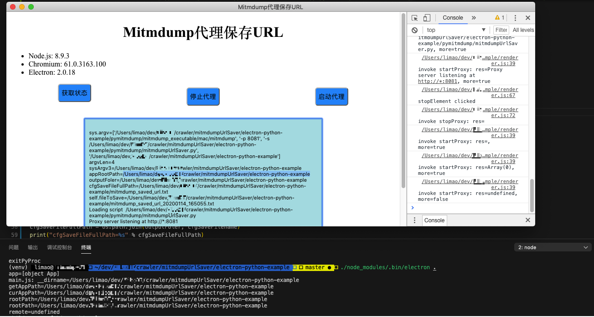
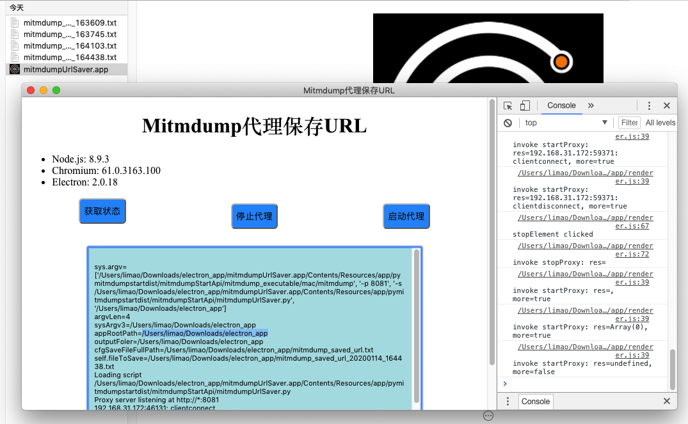

# Mac系统

此处整理关于Mac系统中开发Electron的相关心得。

## npm安装electron速度太慢

mac中npm install很慢，则可以去全局设置源，换成淘宝的源：

```bash
npm config set registry https://registry.npm.taobao.org/
npm config set ELECTRON_MIRROR http://npm.taobao.org/mirrors/electron/
```

且单独给electron的变量，加到启动脚本中：

```bash
vi ~/.zshrc
```

最后加上：

```bash
export ELECTRON_MIRROR=http://npm.taobao.org/mirrors/electron/
```

保存退出后，去立刻生效：

```bash
source ~/.zshrc
```

再去用`echo`验证：

```bash
# echo $ELECTRON_MIRROR
http://npm.taobao.org/mirrors/electron/
```
即可极大地提高 `npm install`去安装electron相关东西的速度。

比如此处是从`<100KB/s` 变成 `> 1MB/s`。

## 获取不到process.env的值

经过之前折腾：

【未解决】Mac中electron打包后process.env是undefined获取不到有效值

确定是：

Mac中，打包后的`app`在运行期间，无法获取到env变量：

`process.env`

或：

```js
const remote = electron.remote;
remote.process.env
```

的值。-》也就无法获取到

`process.env.NODE_ENV`

或：

`remote.process.env.NODE_ENV`

的值了 -》 后续就没法通过别人说的：

```js
const remote = electron.remote
let nodeEnv = remote.process.env.NODE_ENV

const isProd = remote.process.env.NODE_ENV === 'production'

let portableExecutableDir = remote.process.env.PORTABLE_EXECUTABLE_DIR

let initCwd = remote.process.env.INIT_CWD
```

去判断是否是生产环境，以及获取到有效的app可执行文件所在目录了。

## 获取Electron的app的根目录

此处是

文件：`electron-python-example/main.js`

```js
const electron = require('electron')
const app = electron.app
console.log("app=%s", app)

console.log("main.js: __dirname=%s", __dirname)
console.log("getAppPath=%s", app.getAppPath())
// let curAppPath = app.getAppPath()
let curAppPath = __dirname
console.log("curAppPath=%s", curAppPath)

let rootPath = curAppPath
// // for debug:
// let rootPath = "/Users/limao/Downloads/electron_app/mitmdumpUrlSaver.app/Contents/Resources/app"
console.log("rootPath=%s", rootPath)
let removeAppSuffixP = /\/[^\/]+\.app\/Contents\/Resources\/app$/gi
rootPath = rootPath.replace(removeAppSuffixP, "")
console.log("rootPath=%s", rootPath)
```

通过调用：

```js
const createSinglePyProc = (curScript, curPort, curDistFolder) => {

  if (guessPackaged(curDistFolder)) {
    curPyProc = childProcess.execFile(curScript, [curPort, rootPath])
    console.log('execFile curPyProc=%s, from curScript=%s, curPort=%s, rootPath=%s', curPyProc, curScript, curPort, rootPath)
  } else {
    curPyProc = childProcess.spawn('python', [curScript, curPort, rootPath])
    console.log('spawn python curPyProc=%s, from curScript=%s, curPort=%s, rootPath=%s', curPyProc, curScript, curPort, rootPath)
  }
```

传入到Python端：

文件：`electron-python-example/pymitmdump/mitmdumpStartApi.py`

```python
class MitmdumpStartApi(object):
    def __init__(self, rootPath):
        self.appRootPath = rootPath
        logging.debug("self.appRootPath=%s", self.appRootPath)

    @zerorpc.stream
    def startProxy(self):
        """Start mitmdump proxy"""
        logging.debug("startProxy")
        from mitmdumpManage import startMitmdumpSaver
        startResp = startMitmdumpSaver(self.appRootPath)

def main():
    rootPath = sys.argv[2]
    logging.debug("rootPath=%s", rootPath)
    zerorpcServer = zerorpc.Server(MitmdumpStartApi(rootPath))
```

传递给：

文件：`electron-python-example/pymitmdump/mitmdumpManage.py`

```python
def startMitmdumpSaver(appRootPath):
    """Start mitmdump saver"""
    logging.debug("startMitmdumpSaver")
    logging.debug("appRootPath=%s", appRootPath)
    # electron not package: /Users/limao/dev/xxx/crawler/mitmdumpUrlSaver/electron-python-example
    # electron packaged: /Users/limao/Downloads/electron_app
...
    shellCmdList = ['%s' % gConfig["mitmdumpExecutable"], '-p %s' % gConfig["port"], '-s %s' % gConfig["mitmdumpScript"], appRootPath]
```

在启动了mitmdump后，是通过：

文件：`electron-python-example/pymitmdump/mitmdumpUrlSaver.py`

```python
def getOutputFolder():
    print("sys.argv=%s" % sys.argv)
    argvLen = len(sys.argv)
    print("argvLen=%s" % argvLen)

    if argvLen >= 4:
        sysArgv3 = sys.argv[3]
        print("sysArgv3=%s" % sysArgv3)
        appRootPath = sysArgv3
        print("appRootPath=%s" % appRootPath)
        outputFoler = appRootPath
    else:
        outputFoler = os.path.dirname(__file__)

    return outputFoler

outputFoler = getOutputFolder()
print("outputFoler=%s" % outputFoler)
```

中的`sys`的`argv[3]`，最终得到了此处的app的root的path路径：

* 开发环境=本地调试环境：`/Users/limao/dev/xxx/crawler/mitmdumpUrlSaver/electron-python-example`
  * 
* 生产环境=打包发布app后：
  * 当前app运行路径：`/Users/limao/Downloads/electron_app`
  * app的root路径：`app.getAppPath = /Users/limao/Downloads/electron_app/mitmdumpUrlSaver.app/Contents/Resources/app`
    * 
