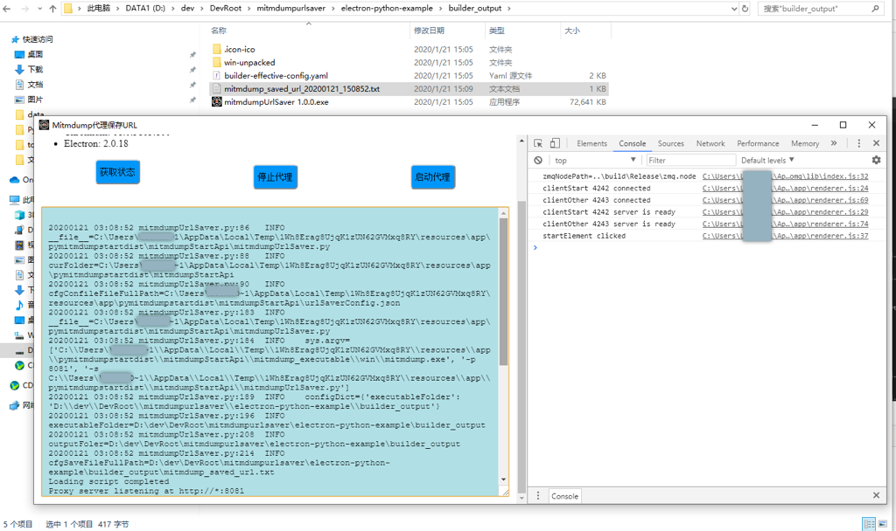

# Win系统

此处整理关于Windows平台中开发Electron的相关心得。

## Win中搭建Electron-Python开发环境

把`node 10`换成`node 8`：

【已解决】windows10中重新安装node把node 10换成node 8

```bash
npm install
```

去初始化

运行Electron本身demo：

```bash
.\node_modules\.bin\electron
```

运行当前Electron项目：

```bash
.\node_modules\.bin\electron .
```

打包：

```bash
npm run dist
```

注：无需`npm run dist_all`

即可打包出exe：

双击运行：
`D:\dev\DevRoot\mitmdumpurlsaver\electron-python-example\builder_output\win-unpacked\mitmdumpUrlSaver.exe`


## windows中启动Electron-python报错：Uncaught Error A dynamic link library DLL initialization routine failed zerorpc  zeromq zmq.node

* **问题**：

文件：`electron-python-example\node_modules\zerorpc\node_modules\zeromq\lib\index.js`

```js
var EventEmitter = require('events').EventEmitter
  , zmq = require('../build/Release/zmq.node')
  , util = require('util');
```

中的：

```js
var zmq = require('../build/Release/zmq.node');
```

运行报错：

```bash
Uncaught Error: A dynamic link library (DLL) initialization routine failed.
\\?\D:\dev\DevRoot\mitmdumpurlsaver\electron-python-example\node_modules\zerorpc\node_modules\zeromq\build\Release\zmq.node
```

* **原因**：

经过一番网上搜索，没人给出解决办法。

后来自己是从

`Uncaught Error: A dynamic link library (DLL) initialization routine failed.`

加上输出的错误路径

`\\?\D:\dev\DevRoot\mitmdumpurlsaver\electron-python-example\node_modules\zerorpc\node_modules\zeromq\build\Release\zmq.node`

中的后面的部分

`D:\dev\DevRoot\mitmdumpurlsaver\electron-python-example\node_modules\zerorpc\node_modules\zeromq\build\Release\zmq.node`

看出是正确的路径，所以怀疑是否是路径方面的问题。后经研究的确就是路径问题。

* **解决办法**：

之前写法是linux中写法，改为同样适配windows的写法：

```js
let path = require('path')
let zmqNodePath = path.join("..", "build", "Release", "zmq.node")
console.log("zmqNodePath=%s", zmqNodePath)
var zmq = require(zmqNodePath)
```

或：

```js
let osIsWin = os.platform() === "win32"
let zmqNodePath = undefined
if (osIsWin){
  let zmqNodePath = '..\\build\\Release\\zmq.node'
} else {
  let zmqNodePath = '../build/Release/zmq.node'
}
var zmq = require(zmqNodePath)
```

即可。

## 运行时Win的exe所在路径

背景：Win中Electron打包后的可执行文件格式一般是`exe`。

需求：希望在运行期间，获取到当前的实际的exe所在目录的路径。

心得：双击`exe`运行后，其内部会解压到临时目录，一般是当前用户的`AppData`目录，类似于这种：

`C:\Users\xxx\AppData\Local\Programs\`

-》如果想要获取原本（双击以启动运行的）exe所在目录，则就很困难了。

期间去试过参数 `--win portable`，对应配置：

```json
    "win": {
      "target": "portable",
      "icon": "assets/icon/logo.png"
    }
```

结果却是，虽然打包出的exe无需安装，双击即可运行，但是运行期间解压的目录是这种更彻底的临时目录：

`C:\Users\xx~1\AppData\Local\Temp\1Wgi1npnbDTNiOqe7pBCQL1FL0Z`


更加没法找到exe所在目录。

后来去试了试别人[提到](https://github.com/electron-userland/electron-builder/issues/3841)的相关参数：

`process.env.PORTABLE_EXECUTABLE_DIR`

最终是可以获取到当前exe所在目录的：

exe所在目录：



相关代码：

```js
let isWin = process.platform === "win32"

if (isWin){
  let portableExecutableDir = process.env.PORTABLE_EXECUTABLE_DIR
  console.log("portableExecutableDir=%s", portableExecutableDir)
}
```

输出：

```bash
portableExecutableDir=D:\dev\DevRoot\mitmdumpurlsaver\electron-python-example\builder_output
```

供参考。
