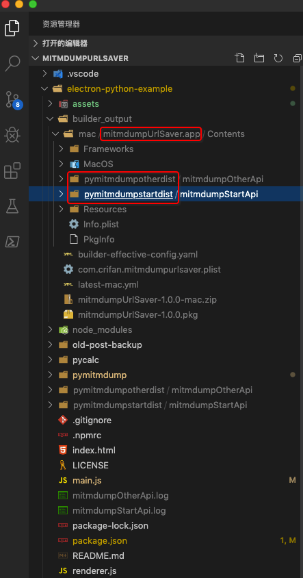

# electron-builder

## signing Error Command failed codesign sign

* **问题**：用`npm run dist`打包报错：
```bash
signing         file=release/mac/ElectronDemo.app identityName=Apple Development: xxx xx (xxx) identityHash=xxx provisioningProfile=none
Error: Command failed: codesign --sign xxx —force
```
* **原因**：code sign方面的错误。
* **解决办法**：暂未深入研究，所以只是去禁止code sign，以规避此问题。
    * 禁止code sign的方法
      * 先去：`export CSC_IDENTITY_AUTO_DISCOVERY=false`
      * 再继续打包：`npm run dist`

## make-dir.js 86 catch SyntaxError Unexpected token {
* **问题**：打包：
```bash
npm run dist
```
报错：
```bash
/Users/limao/dev/src/electron/electron-quick-start/node_modules/electron-builder/node_modules/fs-extra/lib/mkdirs/make-dir.js:86
      } catch {
              ^
SyntaxError: Unexpected token {
```
* **原因**：之前20200529，用：
```bash
npm install -D electron-builder
```
安装出的是最新版本的`electron-builder`：
```json
  "dependencies": {
    "electron-builder": "^22.6.1"
  }
```
而新版`22.6.1`有bug。

* **解决办法**：换个别的稍微旧一点的版本，比如`20.44.4`：
```bash
npm uninstall electron-builder
npm install -D electron-builder@20.44.4
```

## Error loading Python lib /private/var/folders .Python dlopen image not found

* **问题**：`electron-builder`去打包mac的app后运行报错

```bash
curPyProc.spawnargs=/var/folders/gt/5868sbcd1jq4rxvryqhy2_1sz8n0s3/T/.com.crifan.mitmdumpurlsaver.bG5MLj,4243
curPyProc.pid=81849
curPyProc stderr data: chunk=[81849] Error loading Python lib '/private/var/folders/gt/5868sbcd1jq4rxvryqhy2_1sz8n0s3/T/.Python': dlopen: dlopen(/private/var/folders/gt/5868sbcd1jq4rxvryqhy2_1sz8n0s3/T/.Python, 10): image not found

curPyProc exit: exitCode=255
```

* **原因**：此处app中用到了已打包好的`.Python`，但是却没有被打包进去，所以运行报错找不到。
* **解决办法**：去把缺少的东西打包进来，相关参数：`extraFiles`。

此处额外的所需要的事 ，项目根目录下的（之前用PyInstaller打包后的）2个dist文件夹：

  * `pymitmdumpotherdist`
  * `pymitmdumpstartdist`

具体配置是：`build`中`mac`的`extraFiles`

文件：`electron-python-example/package.json`

```json
  "build": {
...
    "mac": {
...
      "extraFiles": [
        "pymitmdumpstartdist",
        "pymitmdumpotherdist"
      ],
      "target": [ "pkg", "zip"]
    }
  }
}
```


如此打包后的app，其中就包括了额外的目录：



-》即可正常运行，没了`.Python`找不到的问题。

## 打包期间实现拷贝整个目录和其中二进制文件到打包后的特定目录

* **背景**：希望实现把打包前的整个目录`electron-python-example/pymitmdump/mitmdump_executable`及其中的子文件夹和文件，拷贝到打包后的位置 `electron-python-example/builder_output/mac/mitmdumpUrlSaver.app/Contents/Resources/app/pymitmdumpstartdist/mitmdumpStartApi/mitmdump_executable`，从而希望后续代码能识别到。
* **解决办法**：通过`extraResources`设置

文件：`electron-python-example/package.json`

```json
  "build": {
...
    "extraResources": [
      {
        "from": "pymitmdump/mitmdump_executable",
        "to": "app/pymitmdumpstartdist/mitmdumpStartApi/mitmdump_executable",
        "filter": ["**/*"]
      }
    ],
```

## 路径中包含中文会无法启动mitmdump代理

* **问题**：Electron打包的app放到别的mac中测试时，路径中有中文，导致无法正常启动mitmdump代理。
* **原因**：路径中包含中文，内部启动mitmdump代理的代码，不支持非中文字符。
* **解决办法**：加上兼容不同编码的字符的路径，即可：

```python
import locale

    curPlatformEncoding = locale.getpreferredencoding()
    logging.info("curPlatformEncoding=%s", curPlatformEncoding)
    # Mac: UTF-8
    # Wind: cp936 ~= GBK ~= GB2312

    curProcess = subprocess.Popen(
        shellCmd,
        stdout=subprocess.PIPE,
        stderr=subprocess.STDOUT,
        universal_newlines=True,
        # encoding="UTF-8",
        encoding=curPlatformEncoding,
        shell=isUseShell,
    )
    logging.debug("curProcess=%s", curProcess)

    while True:
        curLineOutput = curProcess.stdout.readline()
```

实现了：自动判断当前系统编码

* Mac：`UTF-8`
* Win：`cp936`
    * =`GBK`

实现`subprocess`的`readline`内部自动解码，而不会出现解码报错问题。
