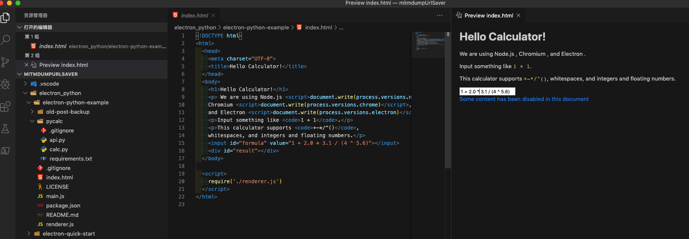
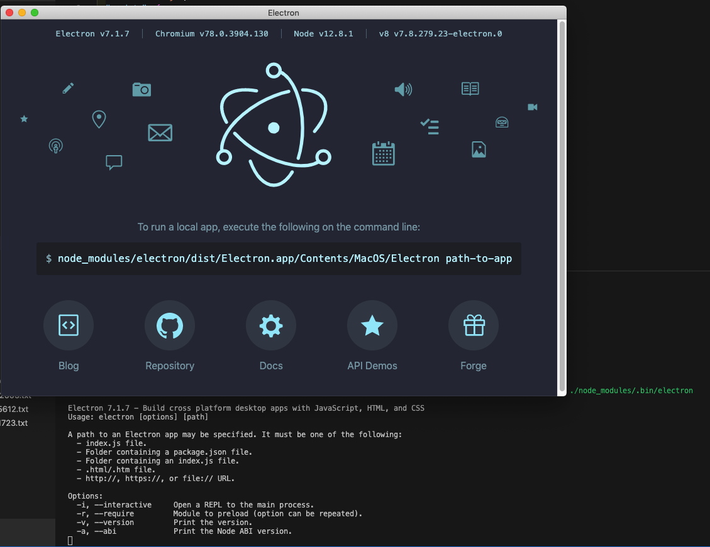
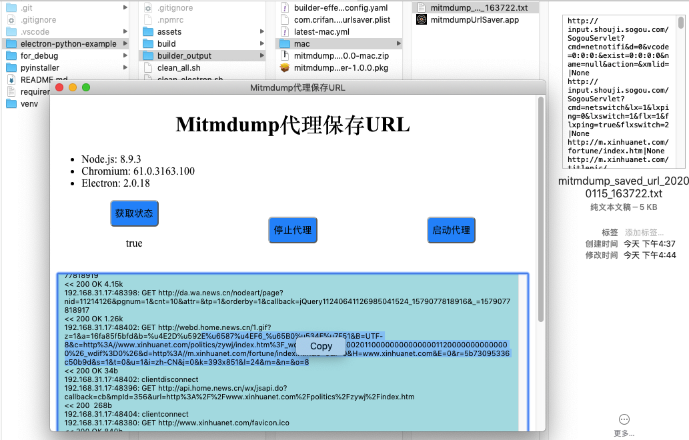

# Electron对python支持

Electron本身官网并没有支持Python。

不过网上有人给出了可行的方案：

* 英文
  * [fyears/electron-python-example: Electron as GUI of Python Applications](https://github.com/fyears/electron-python-example)
* 中文翻译
  * [用 Electron 作为 Python 的 GUI 界面 - 知乎](https://zhuanlan.zhihu.com/p/36356443)

下面介绍环境搭建的详细过程：

## 搭建能运行Python的Electron环境

### 下载代码

```bash
git clone https://github.com/fyears/electron-python-example.git
```

得到文件：

```bash
 tree -CF
.
├── electron-python-example/
│   ├── LICENSE
│   ├── README.md
│   ├── index.html
│   ├── main.js
│   ├── old-post-backup/
│   │   ├── README.md
│   │   ├── hello.py
│   │   ├── main.js
│   │   └── package.json
│   ├── package.json
│   ├── pycalc/
│   │   ├── api.py
│   │   ├── calc.py
│   │   └── requirements.txt
│   └── renderer.js
└── electron-quick-start/
    ├── LICENSE.md
    ├── README.md
    ├── index.html
    ├── main.js
    ├── package-lock.json
    ├── package.json
    ├── preload.js
    └── renderer.js

4 directories, 21 files
```

用VSCode打开，效果是：



### 初始化node环境

> #### warning:: node要安装版本`v8`
> 之前：
> 
> `brew install node`
> 
> 安装出的node是`13.5.0`，会导致后续编译electron有问题，所以需要换`8.x`版本的`node`：
> 
> `brew install node@8`
> 
> 安装后使其生效：
> 
> 把路径加到启动脚本的PATH中：
> 
> `echo 'export PATH="/usr/local/opt/node@8/bin:$PATH"' >> ~/.zshrc`
> 
> 立刻生效：
> 
> `source ~/.zshrc`
> 
> 安装后的版本是：
> 
> * node：`8.17.0`
> * npm: `6.13.4`

根目录`electron-python-example`中：

创建文件`.npmrc`，内容为：

```ini
npm_config_target="2.0.18" # electron version
npm_config_runtime="electron" # 为elelctron编译
npm_config_disturl="https://atom.io/download/electron" # 资源下载地址
npm_config_build_from_source="true" # 从源码编译
```

以及配置文件：`electron-python-example/package.json`

```json
{
  "name": "pretty-calculator",
  "version": "1.0.0",
  "description": "A minimal Electron and Python - based calculator ",
  "main": "main.js",
  "scripts": {
    "start": "electron ."
  },
  "repository": "https://github.com/fyears/electron-python-example",
  "keywords": [
    "Electron",
    "Python",
    "zerorpc",
    "demo"
  ],
  "author": "fyears",
  "license": "MIT",
  "dependencies": {
    "zeromq": "^6.0.0-beta.6",
    "zerorpc": "^0.9.8"
  },
  "devDependencies": {
    "electron": "^2.0.18",
    "electron-builder": "^21.2.0",
    "electron-rebuild": "^1.8.8"
  }
}
```

再去安装：

```bash
npm install
```

### 初始化Python开发环境

#### 虚拟环境

此处Python的虚拟环境选择用：`virtualenv`

* 安装：

```bash
pip install virtualenv
```

* 新建：

```bash
virtualenv venv
```

* 进入：

```bash
source venv/bin/activate
```

#### 安装依赖的库

安装负责`js`和`python`之间的通信的`zerorpc`：

```bash
pip install zerorpc
```

### 启动Electron

每次启动前最好清除缓存

根据[作者](https://github.com/fyears/electron-python-example)解释，每次启动之前，最好去清除一下各种缓存，防止干扰：

```bash
rm -rf ~/.node-gyp
rm -rf ~/.electron-gyp
rm -rf ./node_modules
rm -f package-lock.json
```

启动electron

```bash
./node_modules/.bin/electron
```

界面效果：



### 测试zerorpc通信

再去测试zerorpc通信是否正常，Python代码是否可用：

打开某个终端去：

```bash
python pycalc/api.py
```

正常输出是：

```bash
start running on tcp://127.0.0.1:4242
```

再去另外一个终端：

```bash
virtualenv venv
source venv/bin/activate

zerorpc tcp://localhost:4242 calc "1 + 1"
```

正常输出：

```bash
connecting to "tcp://localhost:4242"
2.0
```


即表示`zerorpc`通信正常，`js`可以和`Python`代码交互了。

然后再去启动electron：

```bash
./node_modules/.bin/electron .
```

即可看到计算器的界面：


至此即在mac中跑通此处的`electron-python-example`了。

剩下的就是自己实现自己需要的逻辑和功能了。

## 打包和发布

在实现了自己的业务逻辑和功能后，再去打包和发布。

### python的打包

先用`PyInstaller`打包：

```bash
cd electron-python-example

rm -rf build
rm -rf *.spec
rm -rf pymitmdumpstartdist
rm -rf pymitmdumpotherdist

pyinstaller pymitmdump/mitmdumpStartApi.py --distpath pymitmdumpstartdist --add-data "pymitmdump/mitmdump_executable:mitmdump_executable" --add-data "pymitmdump/mitmdumpUrlSaver.py:."

pyinstaller pymitmdump/mitmdumpOtherApi.py --distpath pymitmdumpotherdist
```

此处会生成的2个dist目录：

* `pymitmdumpstartdist`
    * 二进制文件：`electron-python-example/pymitmdumpstartdist/mitmdumpStartApi/mitmdumpStartApi`
    * 以及我们拷贝的：
        * 整个目录：`electron-python-example/pymitmdumpstartdist/mitmdumpStartApi/mitmdump_executable`
        * 单个py文件：`electron-python-example/pymitmdumpstartdist/mitmdumpStartApi/mitmdumpUrlSaver.py`
* `pymitmdumpotherdist`
    * 二进制文件：`electron-python-example/pymitmdumpotherdist/mitmdumpOtherApi/mitmdumpOtherApi`

### electron的打包

再去用`electron-builder`打包：

```bash
rm -rf builder_output

npm run dist
```

生成：

* **app**：`electron-python-example/builder_output/mac/mitmdumpUrlSaver.app`
  * 
* **app的zip压缩包**：`electron-python-example/builder_output/mitmdumpUrlSaver-1.0.0-mac.zip`
* **pkg**：`electron-python-example/builder_output/mitmdumpUrlSaver-1.0.0.pkg`
    * 注：Mac中安装后，但在应用程序中找不到对应的app。暂未深究，原因未知，肯能和code sign有关系。

### 运行

双击打包出来的app即可运行：



### 其他说明

### `package.json`最新完整配置及说明

此处最后的`package.json`配置为：

```json
{
  "name": "MitmdumpUrlSaver",
  "version": "1.0.0",
  "description": "Use mitmdump proxy to save out url",
  "main": "main.js",
  "scripts": {
    "start": "electron .",
    "pack": "electron-builder --dir",
    "dist": "electron-builder",
    "dist_all": "electron-builder -mw"
  },
  "repository": "https://github.com/fyears/electron-python-example",
  "keywords": [
    "Electron",
    "Python",
    "zerorpc",
    "mitmdump"
  ],
  "author": "Crifan Li",
  "license": "MIT",
  "dependencies": {
    "electron-context-menu": "^0.15.2",
    "zeromq": "^6.0.0-beta.6",
    "zerorpc": "^0.9.8"
  },
  "devDependencies": {
    "electron": "^2.0.18",
    "electron-builder": "^21.2.0",
    "electron-rebuild": "^1.8.8"
  },
  "build": {
    "productName": "mitmdumpUrlSaver",
    "appId": "com.crifan.mitmdumpurlsaver",
    "copyright": "Copyright © 2020 ${author} String",
    "directories": {
      "output": "builder_output"
    },
    "files": [
      "**/*",
      "!**/node_modules/*/{CHANGELOG.md,README.md,README,readme.md,readme}",
      "!**/node_modules/*/{test,__tests__,tests,powered-test,example,examples}",
      "!**/node_modules/*.d.ts",
      "!**/node_modules/.bin",
      "!**/*.{iml,o,hprof,orig,pyc,pyo,rbc,swp,csproj,sln,xproj}",
      "!.editorconfig",
      "!**/._*",
      "!**/{.DS_Store,.git,.hg,.svn,CVS,RCS,SCCS,.gitignore,.gitattributes}",
      "!**/{__pycache__,thumbs.db,.flowconfig,.idea,.vs,.nyc_output}",
      "!**/{appveyor.yml,.travis.yml,circle.yml}",
      "!**/{npm-debug.log,yarn.lock,.yarn-integrity,.yarn-metadata.json}",
      "!build",
      "!pymitmdump",
      "!pycalc",
      "!old-post-backup",
      "!*.log",
      "!*.txt",
      "!*.md",
      "!*.spec"
    ],
    "asar": false,
    "mac": {
      "category": "public.app-category.developer-tools",
      "type": "distribution",
      "icon": "assets/icon/icon.icns",
      "target": [
        "pkg",
        "zip"
      ]
    },
    "win": {
      "target": "nsis",
      "icon": "assets/icon/logo.png"
    }
  }
}
```


(1) `file`

其中

```json
"**/*",
"!**/node_modules/*/{CHANGELOG.md,README.md,README,readme.md,readme}",
"!**/node_modules/*/{test,__tests__,tests,powered-test,example,examples}",
"!**/node_modules/*.d.ts",
"!**/node_modules/.bin",
"!**/*.{iml,o,hprof,orig,pyc,pyo,rbc,swp,csproj,sln,xproj}",
"!.editorconfig",
"!**/._*",
"!**/{.DS_Store,.git,.hg,.svn,CVS,RCS,SCCS,.gitignore,.gitattributes}",
"!**/{__pycache__,thumbs.db,.flowconfig,.idea,.vs,.nyc_output}",
"!**/{appveyor.yml,.travis.yml,circle.yml}",
"!**/{npm-debug.log,yarn.lock,.yarn-integrity,.yarn-metadata.json}",
```

是从官网 [Application Contents - electron-builder](https://www.electron.build/configuration/contents#files) 拷贝出来的默认的配置；

余下部分：

```json
      "!build",
      "!pymitmdump",
      "!pycalc",
      "!old-post-backup",
      "!*.log",
      "!*.txt",
      "!*.md",
      "!*.spec"
```

是自己加的，用于排除此处不需要打包的文件。

(2) `asar`

`asar`参数默认是开启的，其会导致此处二进制可执行文件：

* mitmdumpUrlSaver.app/Contents/Resources/app/pymitmdumpstartdist/mitmdumpStartApi/mitmdumpStartApi
    * 无法运行
* mitmdumpUrlSaver.app/Contents/Resources/app/pymitmdumpotherdist/mitmdumpOtherApi/mitmdumpOtherApi
    * 可以运行

根本原因：未知

规避办法：只能去关闭掉asar：

```json
"asar": false,
```

才能正常运行mitmdumpStartApi和mitmdumpOtherApi

> #### info:: 更多细节
> 详见：
> 
> 【已解决】Mac中运行跑通electron-python-example的示例
